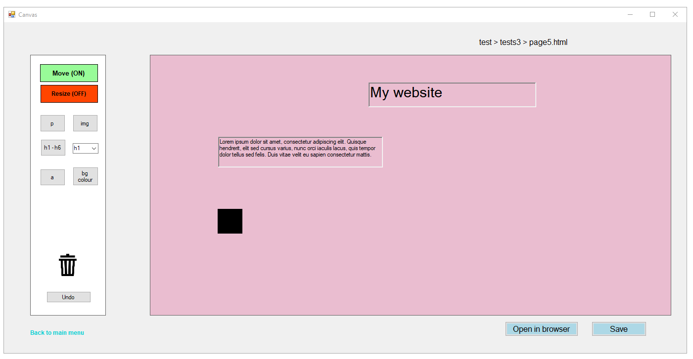

# WORK IN PROGRESS

### Website-builder

This project allows users to create and design websites via an intuitive drag and drop system.

#### Technologies
Visual basic 

Microsoft Access

HTML5/CSS

### Non exhaustive functionality list

Can login, register, and reset password (using a code that gets sent to your email).

Able to drag and drop elements into the panel, which would create change in the html and css files, and therefore the appearence of the page when opened
in a web browser.

HTML elements that can be used: Paragraph, image, anchor, and heading.

Can manipulate attributes of a html/css element such as the colour of the text andthe size of the element  

