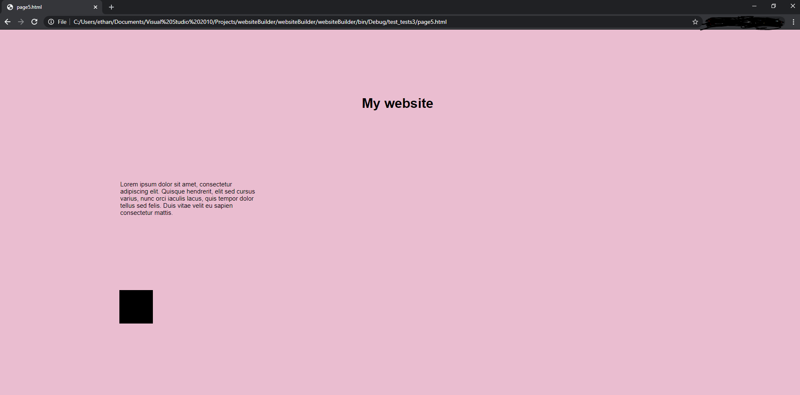

# WORK IN PROGRESS

### Website-builder

This project allows users to create and design websites via an intuitive drag and drop system.

#### Technologies
Visual basic 

Microsoft Access

HTML5/CSS

### Current functionality

Can login, register, and reset password (using a code that gets sent to your email).

Able to drag and drop elements into the panel, which would create change in the html and css files, and therefore the appearence of the page when opened
in a web browser.

Current elements that can be used: Paragraph, image, anchor, and heading.

### Note that the following images are a demonstation and are not the final product

